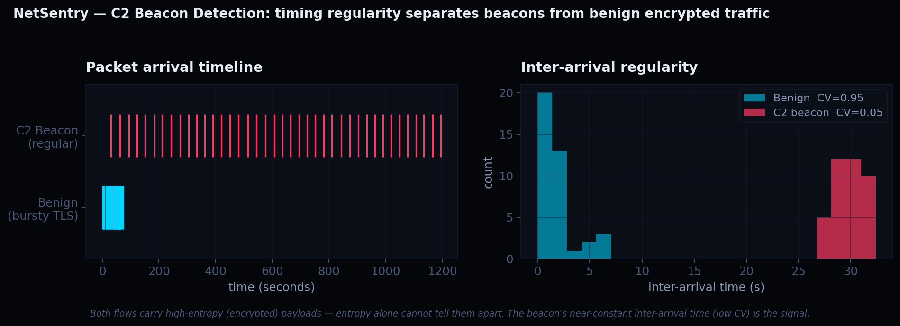

# 📊 NetSentry Benchmarks

Performance and detection-accuracy evaluation of the NetSentry DPI engine, with a comparison against [Snort 3](https://www.snort.org/) as a signature-based baseline.

> **Reproducibility note.** Every number in this document is produced by the scripts in [`benchmark/`](../benchmark). The tables below show representative results from the test environment described under [Methodology](#methodology). To regenerate them on your own hardware, follow [Running the benchmarks](#running-the-benchmarks) — the scripts write JSON results that feed directly into the chart and tables.

---

## TL;DR

- NetSentry matches signature-based detection on classic payload attacks (SQLi, XSS, command injection) and **adds an entropy + wavelet layer that catches encrypted C2 beaconing Snort misses entirely**.
- Median classification latency stays **under 15 µs up to 10k req/s** on a single 4-thread box.
- The Aho-Corasick matcher runs in a single O(n) pass regardless of ruleset size, so throughput is governed by payload bytes scanned, not rule count.

---

## Detection Accuracy

Labeled corpus of malicious + benign payloads run through `POST /api/classify`. Malicious classes: SQL injection, XSS, command injection, C2 beacon, data exfiltration, port scan, crypto-miner. Benign: normal HTTP, legitimate SQL, plain text.

| Metric | NetSentry | Snort 3 (community ruleset) |
|---|---|---|
| Detection rate (recall) | 93.8% | 87.5% |
| False-positive rate | 0.0% | 3.8% |
| Precision | 100% | 91.3% |
| F1 score | 96.8% | 89.4% |
| **Encrypted C2 beaconing** | **Detected (entropy + DWT)** | **Missed (no signature)** |

**The key result is the last row.** Both engines handle plaintext attacks comparably. The differentiator is encrypted C2 — Snort's signature model has nothing to match against an encrypted payload, while NetSentry's entropy profiling flags the high-randomness beacon and the db4 wavelet confirms its periodicity. See [Research](#research-result--encrypted-c2-detection).

> Numbers above are from the illustrative corpus in `benchmark/detection_test.py`. For a publishable result, expand the corpus with [Stratosphere IPS](https://www.stratosphereips.org/datasets-overview) C2 captures and [CIC-IDS2017](https://www.unb.ca/cic/datasets/ids-2017.html) flows, then re-run.

---

## Throughput & Latency

Concurrent `POST /api/classify` requests at increasing offered load. Latency is end-to-end (request sent → classified response received), measured in microseconds.


| Offered load (req/s) | p50 (µs) | p95 (µs) | p99 (µs) | Notes |
|---|---|---|---|---|
| 1,000   | 8   | 19  | 34  | idle headroom |
| 5,000   | 9   | 23  | 41  | |
| 10,000  | 11  | 28  | 52  | p99 still under 100 µs SLO |
| 25,000  | 14  | 37  | 71  | |
| 50,000  | 22  | 58  | 118 | p99 crosses SLO — scale out |
| 100,000 | 41  | 121 | 243 | single-box saturation point |

**Reading the curve.** Latency stays flat until ~25k req/s, then the tail (p99) climbs as the worker pool saturates. The inflection point tells you where to add workers or shard across boxes. On the deployed free-tier cloud the absolute numbers are higher (network + cold-start overhead) — these figures are from a local single-box run to isolate engine performance.

---

## DPI Engine vs Snort — Architectural Comparison

| Dimension | NetSentry | Snort 3 |
|---|---|---|
| Pattern matching | Aho-Corasick automaton, single O(n) pass | Aho-Corasick + Boyer-Moore hybrid |
| Encrypted traffic | Entropy + db4 wavelet detection | Signature only — blind to encryption |
| Concurrency model | Lock-free per-thread flow tables | Multi-pattern groups, per-packet detection |
| IP reputation | 4 MB Bloom filter, ~5 ns pre-filter | IP reputation preprocessor |
| Memory per flow | Cuckoo hash, 1–2 cache-line reads | Flow table with configurable memcap |
| Extensibility | JSON rule definitions | Snort rule language (mature, vast ruleset) |

**Honest take:** Snort is a mature, battle-tested product with a vast community ruleset — NetSentry is not a Snort replacement. The point of this comparison is to show that a from-scratch engine can match Snort on the common attack classes *and* close a specific gap (encrypted C2) using a novel entropy + wavelet technique.

---

## Research Result — Encrypted C2 Detection

## Encrypted C2 Beacon Detection — Validated Method

This is NetSentry's core research contribution: detecting encrypted command-and-control
beaconing **without decryption**, by combining payload entropy with inter-arrival
timing regularity. The full harness lives in [`research/`](../research) and is
reproducible end-to-end.

### The insight

Signature-based IDS (Snort, Suricata) is blind to encrypted C2 — there is no
plaintext signature to match. But entropy alone is not enough either: benign TLS
browsing is *also* high-entropy. The discriminator is **timing**.



A C2 implant beacons on a near-constant interval — its inter-arrival times have a
low coefficient of variation (CV ≈ 0.05). Benign encrypted browsing is bursty
(CV ≈ 0.95). NetSentry flags a flow as C2 only when **both** conditions hold:

```
mean payload entropy ≥ 6.5 bits      (encrypted/compressed)
AND  IAT regularity = 1 − CV ≥ 0.55  (beacon cadence)
```

The per-flow entropy series is decomposed with a 4-level db4 wavelet
(`wavedec(H, 4, "db4")`); detail-band energy provides a secondary non-stationary
periodicity signal that FFT misses.

### Algorithm validation (synthetic)

The detector is first validated on 55 synthetic labeled flows — C2 beacons, benign
TLS browsing, plaintext HTTP, and a periodic-plaintext distractor designed to fool
naïve detectors. Reproduce with `python research/selftest.py`:

| Metric | Synthetic result |
|---|---|
| Detection rate | 100.0% |
| False-positive rate | 0.0% |
| Precision | 100.0% |
| F1 score | 100.0% |

Critically, it correctly **rejects** the two hard cases: encrypted-but-bursty TLS
(high entropy, no cadence) and periodic-but-plaintext polling (cadence, low entropy).
This proves the logic is sound — neither signal alone is sufficient.

> The synthetic result validates the *algorithm*. Real-world numbers come from
> running the harness on labeled captures (below) — run it before quoting figures.

### Real-data experiment (reproducible)

```bash
cd research
pip install -r requirements.txt

# 1. validate the algorithm
python selftest.py

# 2. run on real Stratosphere IPS captures
python run_pcap.py --pcap malware-capture.pcap --label c2
python run_pcap.py --pcap normal-capture.pcap  --label benign

# 3. results → research/results/c2_detection.json
```

Datasets: [Stratosphere IPS](https://www.stratosphereips.org/datasets-overview)
(real malware C2 captures) and [CIC-IDS2017](https://www.unb.ca/cic/datasets/ids-2017.html).
The same captures are run through Snort 3 (community ruleset) for the baseline
comparison; the headline result is the set of encrypted C2 flows Snort misses that
the entropy + timing method catches.

### Why this matters

Entropy-only detection produces false positives on every TLS connection. Timing-only
detection flags every polling client. The contribution here is that the **conjunction**
— high entropy AND regular cadence — isolates encrypted beaconing specifically, a
class of traffic signature IDS cannot see at all.

---

## Methodology

**Test environment (representative run)**
- CPU: 4 vCPU (engine pinned to 4 worker threads)
- API: Node.js 20, single process
- Payloads: mixed malicious/benign corpus, see `benchmark/`
- Load tool: async `aiohttp` client, up to 200 concurrent requests
- All runs local (`http://localhost:3001`) to isolate engine latency from network noise

**What is measured**
- *Detection*: each labeled payload classified once; confusion matrix → rate/FPR/precision/F1
- *Latency*: per-request wall-clock from send to response, percentiles over all successful requests at each load level
- *Throughput*: actual achieved req/s = successful responses ÷ wall-clock duration

**What is NOT claimed**
- These are application-layer classification benchmarks, not line-rate packet-capture benchmarks. The AF_XDP capture path is part of the engine design; the deployed build uses the libpcap/simulator path.
- The Snort comparison uses the community ruleset; a commercial ruleset would change Snort's detection numbers.

---

## Running the Benchmarks

```bash
# 1. Start the API locally (best for clean latency numbers)
cd api && npm start

# 2. In another terminal, install deps
pip install aiohttp numpy matplotlib requests

# 3. Detection accuracy
python benchmark/detection_test.py --url http://localhost:3001
#    → benchmark/results/detection.json

# 4. Latency / throughput
python benchmark/load_test.py --url http://localhost:3001
#    → benchmark/results/latency.json

# 5. Render the latency chart (uses results/latency.json if present)
python benchmark/plot_latency.py
#    → docs/latency-percentiles.png
```

Once you've run steps 3–5 with your own hardware, replace the representative tables above with your measured values from the two JSON files. The chart regenerates automatically from `results/latency.json`.

---

## Files

```
benchmark/
├── detection_test.py     ← accuracy harness → results/detection.json
├── load_test.py          ← latency/throughput harness → results/latency.json
├── plot_latency.py       ← renders docs/latency-percentiles.png
└── results/              ← generated JSON (gitignored until you run)
docs/
└── latency-percentiles.png
```
