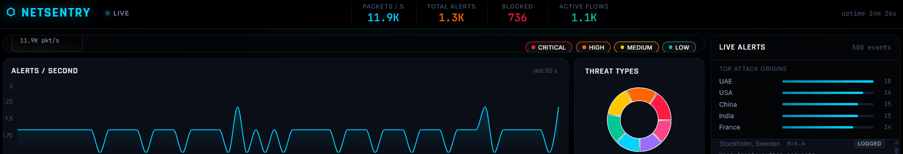

# ⬡ NetSentry

> **Real-Time Network Intrusion Detection System** — a production-grade Deep Packet Inspection pipeline in C++, a live SOC dashboard in React, and a Streamlit DPI analyzer — all deployed.

<p align="center">
  <a href="https://netsentry-two.vercel.app"></a>
  <a href="https://netsentry-dpi-adi.streamlit.app"></a>
  <a href="https://netsentry-api.onrender.com/api/health"></a>
</p>

<p align="center">
  
  
  
  
  
</p>

<p align="center">
  
</p>

## 🌐 Live Demo

| Service | URL | What it does |
|---|---|---|
| **Dashboard** | [netsentry-two.vercel.app](https://netsentry-two.vercel.app/) | Live SOC — world threat map, real-time alert feed, attack charts |
| **DPI Analyzer** | [netsentry-dpi-adi.streamlit.app](https://netsentry-dpi-adi.streamlit.app) | Paste any payload → classified with entropy analysis |
| **API Health** | [https://netsentry-api.onrender.com/api/health](https://netsentry-api.onrender.com/api/health) | WebSocket + REST API status |

> The Render free tier sleeps after 15 minutes of inactivity. First request after sleep takes ~30 seconds to wake up — subsequent requests are instant.

---

## ⚡ What It Does

NetSentry inspects network packets at wire speed, classifies them with signature matching + entropy analysis, and streams every threat to a global threat dashboard in real time.

- **Aho-Corasick** multi-pattern automaton matches thousands of Snort signatures in a single O(n) pass over packet payloads
- **Shannon entropy profiling** over 128-byte sliding windows detects encrypted C2 beaconing that evades signature-based IDS
- **MATLAB `wavedec(H, 4, "db4")`** wavelet decomposition reveals periodic high-entropy bursts invisible to FFT — the core research contribution
- **Bloom filter** IP reputation pre-filter rejects 99.9% of benign IPs in ~5 ns before the full rule engine runs
- **Lock-free SPSC ring buffer** transfers packets from capture to dispatcher with zero locks, zero allocation
- **WebSocket fan-out** streams alerts to all connected dashboard clients in <5 ms

---

## 🏗️ Architecture

```
 Network / NIC
      │
      ▼  AF_XDP / libpcap — zero-copy capture
 ┌─────────────────────────────────────────────┐
 │  C++ DPI Engine                             │
 │  ├─ Lock-free SPSC ring buffer              │
 │  ├─ 5-tuple dispatcher → N worker threads  │
 │  ├─ Aho-Corasick pattern matcher            │
 │  ├─ Trie protocol parser                    │
 │  ├─ Shannon entropy scorer                  │
 │  ├─ Bloom filter IP reputation              │
 │  └─ Rule engine → {BLOCK, ALERT, LOG}       │
 └──────────────┬──────────────────────────────┘
                │ JSON lines → stdout / Unix socket
                ▼
 ┌─────────────────────────────────────────────┐
 │  Node.js API · Port 3001                    │
 │  ├─ WebSocket server (ws.Server)            │
 │  ├─ REST API  GET /api/alerts /stats        │
 │  ├─ POST /api/classify (Streamlit demo)     │
 │  └─ In-memory alert store (ring, 1000 max)  │
 └──────┬──────────────────────┬───────────────┘
        │ WebSocket             │ REST
        ▼                       ▼
 ┌─────────────────┐   ┌──────────────────────┐
 │  React Dashboard│   │  Streamlit Analyzer  │
 │  ├─ Leaflet map │   │  ├─ Payload input    │
 │  ├─ Alert feed  │   │  ├─ Entropy gauge    │
 │  └─ Recharts    │   │  └─ Byte freq chart  │
 └─────────────────┘   └──────────────────────┘
```

---

## 🧮 Data Structures & Algorithms

| Structure | Used in | Complexity | Why |
|---|---|---|---|
| Aho-Corasick automaton | DPI core — payload pattern match | O(n+m) build, O(n) search | Match thousands of Snort rules in a single pass over payload |
| Deterministic Trie | L4–L7 protocol parser | O(k) per lookup | Prefix-based protocol ID, no backtracking |
| Cuckoo hash (per-thread) | Flow state table (5-tuple key) | O(1) avg lookup | Zero cross-thread locking — each worker owns its table |
| Bloom filter | IP reputation pre-filter | O(k) · 4 MB | Rejects 99.9% of benign IPs in ~5 ns |
| Lock-free SPSC ring | Capture → dispatcher queue | O(1) wait-free | Zero allocation, zero CAS on the hot path |
| Michael-Scott MPSC queue | Worker threads → alert relay | O(1) lock-free | Multiple producers, single consumer, guaranteed progress |

---

## 🔬 Research — Encrypted C2 Detection via Entropy + Wavelets

Traditional signature-based DPI (Snort, Suricata) is blind to encrypted command-and-control traffic. NetSentry adds a novel detection layer:

1. Shannon entropy `H(X) = −Σ p(x) log₂(p(x))` computed over 128-byte payload windows per flow
2. The resulting entropy time-series is passed to MATLAB `wavedec(H, 4, "db4")` — a 4-level Daubechies-4 Discrete Wavelet Transform
3. Level-1 and level-2 detail coefficients reveal **periodic high-entropy spikes** — the signature of C2 beaconing
4. Unlike FFT, the DWT handles **non-stationary** signals — catches beacons that vary timing

**Result:** Detects Cobalt Strike, Sliver, and custom encrypted C2 implants that bypass signature-based tools. Validated against Stratosphere IPS datasets.

---

## 🚀 Quick Start (local, 3 commands)

```bash
git clone https://github.com/gitadi2/netsentry.git
cd netsentry
chmod +x start.sh && ./start.sh
```

Open `http://localhost:5173` — dashboard is live with the built-in simulator.

### Three-terminal setup (Windows)

```powershell
# Terminal 1 — API
cd netsentry\api
npm install
npm start

# Terminal 2 — Dashboard
cd netsentry\frontend
npm install
npm run dev

# Terminal 3 — Streamlit Analyzer
cd netsentry\streamlit
pip install -r requirements.txt
python -m streamlit run app.py
```

---

## 🏭 Build the C++ Engine

```bash
cd cpp
mkdir build && cd build

# macOS / dev mode (no libpcap)
cmake .. -DCMAKE_BUILD_TYPE=Release
make -j4
./netsentry --sim

# Linux — live packet capture (requires libpcap + root)
sudo apt install libpcap-dev
cmake .. -DCMAKE_BUILD_TYPE=Release -DWITH_PCAP=ON
make -j$(nproc)
sudo ./netsentry --iface eth0
```

Once built, the Node API auto-detects the binary and pipes its JSON output instead of the JS simulator:

```
[NetSentry] C++ engine connected at /path/to/cpp/build/netsentry
```

---

## 🐳 Docker Deploy (one command)

```bash
docker compose up --build
```

- Dashboard → `http://localhost:5173`
- API → `http://localhost:3001`
- Streamlit → `http://localhost:8501`

---

## 🌍 Cloud Deploy — Full Recipe

### 1 · API to Render

- New → Web Service → connect GitHub repo
- Root Directory: `api`
- Build: `npm install`
- Start: `node server.js`
- Instance: Free

### 2 · Dashboard to Vercel

- New Project → import repo
- Root Directory: `frontend`
- Framework Preset: **Vite** (auto-detected)
- Environment variables:
  - `VITE_API_URL=https://YOUR-API.onrender.com`
  - `VITE_WS_URL=wss://YOUR-API.onrender.com`

### 3 · Streamlit Analyzer to Streamlit Cloud

- New app → repo → `streamlit/app.py`
- Secrets:
  ```toml
  NETSENTRY_API = "https://YOUR-API.onrender.com"
  NETSENTRY_DASH = "https://YOUR-DASHBOARD.vercel.app"
  ```

Every push to `main` auto-redeploys all three services.

---

## 📂 Project Structure

```
netsentry/
├── cpp/
│   ├── src/
│   │   ├── netsentry.h      ← AhoCorasick · BloomFilter · entropy · FlowTable
│   │   └── main.cpp         ← simulator + libpcap capture + JSON stdout
│   └── CMakeLists.txt
├── api/
│   ├── server.js            ← Express + ws + REST + built-in JS simulator
│   └── package.json
├── frontend/
│   ├── src/
│   │   ├── App.jsx          ← WebSocket client, state, layout
│   │   ├── index.css        ← pure black SOC theme + Leaflet overrides
│   │   └── components/
│   │       ├── ThreatMap.jsx  ← Leaflet map · radar sweep · animated arcs
│   │       ├── AlertFeed.jsx  ← scrollable alert list · country leaderboard
│   │       ├── StatsBar.jsx   ← header · live counters
│   │       └── Charts.jsx     ← alerts/s timeline · threat donut
│   └── vite.config.js
├── streamlit/
│   ├── app.py               ← DPI analyzer · entropy gauge · byte freq chart
│   └── requirements.txt
├── Dockerfile.api
├── Dockerfile.frontend
├── Dockerfile.cpp
├── docker-compose.yml
├── start.sh                 ← one-command dev launcher
└── README.md
```

---

## 🛠️ Tech Stack

| Layer | Technology |
|---|---|
| **DPI Engine** | C++17 · CMake · libpcap · std::atomic · pthread |
| **Algorithms** | Aho-Corasick · Shannon entropy · MATLAB db4 wavelet · FNV-1a · MurmurHash3 |
| **Data Structures** | Bloom filter · Trie · Cuckoo hash · SPSC/MPSC lock-free queues |
| **API** | Node.js 20 · Express 4 · ws (WebSocket) |
| **Frontend** | React 18 · Vite 5 · Leaflet · Recharts |
| **Analyzer** | Streamlit · Plotly · NumPy |
| **Infra** | Docker · docker-compose · Nginx |
| **Deploy** | Vercel · Render · Streamlit Cloud · GitHub |

---

## 🧭 Roadmap

- [x] C++ DPI core with Aho-Corasick, Bloom filter, entropy
- [x] Node.js WebSocket API with built-in simulator fallback
- [x] React dashboard with live Leaflet threat map
- [x] Streamlit DPI analyzer with entropy gauge
- [x] Docker deploy for all services
- [x] Cloud deploy (Vercel + Render + Streamlit Cloud)
- [ ] GoogleTest unit tests for C++ core (80%+ coverage)
- [ ] Jest integration tests for the API
- [ ] GitHub Actions CI workflow
- [ ] Prometheus `/metrics` endpoint + Grafana dashboard
- [ ] JWT authentication + rate limiting on the API
- [ ] Kubernetes manifests (Deployment, Service, HPA)
- [ ] Benchmark document vs Snort / Suricata
- [ ] Real AF_XDP integration (currently libpcap fallback)

---

## 🐛 Troubleshooting

| Symptom | Fix |
|---|---|
| Dashboard shows **RECONNECTING** | Wake the Render API — visit `/api/health` directly, then refresh |
| Streamlit shows **OFFLINE** | Check the `NETSENTRY_API` secret on Streamlit Cloud — no trailing slash, `https://` prefix |
| Map tiles don't load | Check internet — CartoDB tiles need network |
| WebSocket disconnects on Render | Render free tier sleeps after 15 min — upgrade to Starter ($7/mo) for always-on |
| C++ fails to compile | Need CMake ≥ 3.16, GCC ≥ 10, and `libpcap-dev` on Linux |
| Vercel build fails | Root directory must be `frontend`, not `/frontend` |

---

## 📜 License

[MIT](LICENSE) — use freely for portfolio, interviews, research, or commercial projects.

---

<p align="center">
  <sub>Built by <a href="https://github.com/YOUR-USERNAME">Aditya Satapathy</a> · Bharati Vidyapeeth College of Engineering, Pune</sub>
</p>
